# Basic TipBot Commands

Our Discord TipBot is working only with / (slash command) as required by Discord.

If you have any issue with these help, kindly join our Discord <http://join.btipz.com>. Please go to [Advance](./advanced_discord_commands.md) for additional commands.

### Deposit

You can check any supported coin in our Discord TipBot with `/deposit <token name>`. You can also select a `<token name>` from dropdown menu or you can type it directly.

Example `/balance token: wrkz`, `/balance token: doge`.

In case you would like to go to plain format of the address. `/deposit token: doge plain: plain`.

**Note**: Some coin/token requires <ins>MEMO</ins>. Please always include your unique <ins>MEMO</ins> if requires.

<figure markdown>
  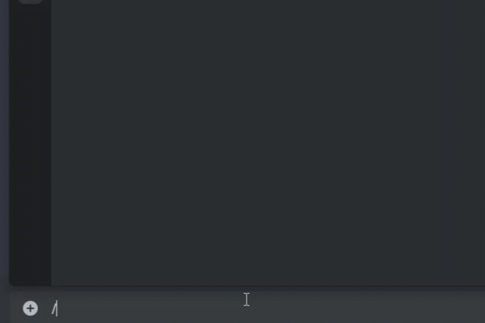{ width="450" }
  <figcaption>Deposit command</figcaption>
</figure>

### Checking balance(s)

The balance can be checked everytime with `/balance <token name>`. If you would like to check all coins/tokens, please use `/balances` (with s). It's possible to check a coin/token's balance from `/deposit` menu. You would see a button "Balance".

<figure markdown>
  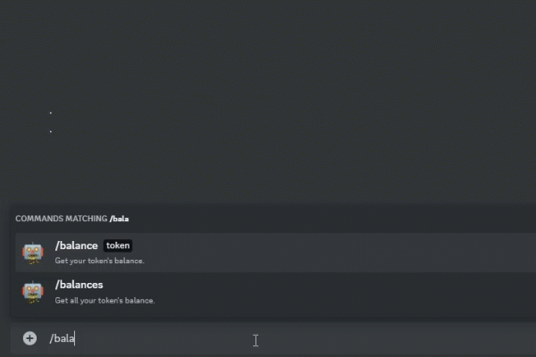{ width="450" }
  <figcaption>Balance(s) command</figcaption>
</figure>

**Note**: You can sort your balance by value $ or by alphabet. You can also add a coin/token to your favorite with the menu "Add" or "Remove". The favorite coins/tokens will be shown at the first page when you command `/balances`.

### Withdraw / Send

The command `/withdraw` is the same as `/send`. You can check each coin's withdraw fee with `/coininfo coin: coin_name`. Each withdraw, TipBot will ask for a confirmation with a fee.

<figure markdown>
  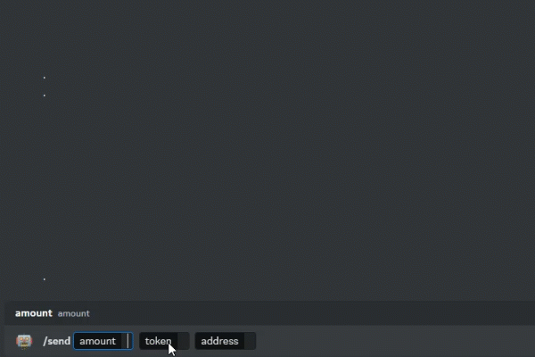{ width="450" }
  <figcaption>Withdraw/Send command</figcaption>
</figure>

For tokens such as Stellar assets, you can use `/transfer token:` command. TipBot will popup and allow you to give MEMO. For CryptoNote coin, `/transfer token:` will allow you to give Payment Id.

<figure markdown>
  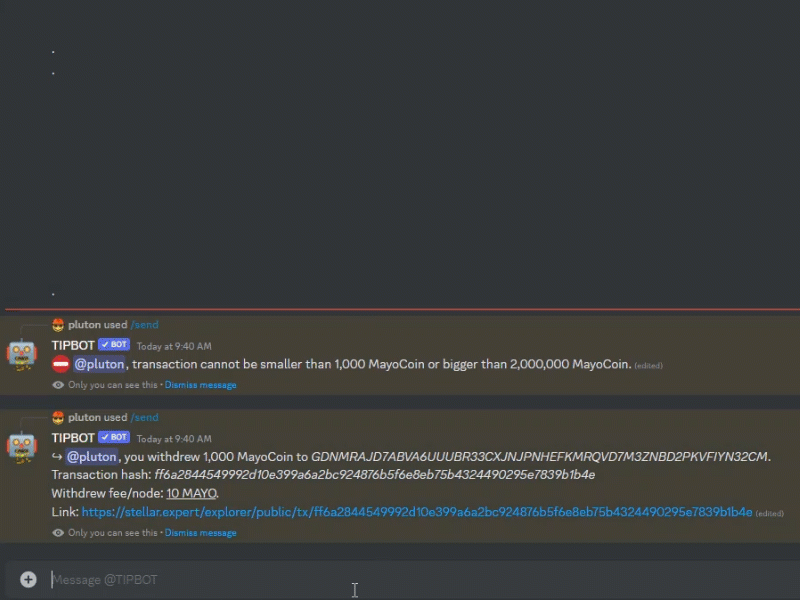{ width="450" }
  <figcaption>Transfer command</figcaption>
</figure>

### Tipping

Tipping can be done with `/tip` command. Bot will popup all necessary parameters and optionally additional parameter(s). Simple tipping is done by `/tip amount:1k token:wrkz args:@Rogerrobers#6434`. `arg:` can be by mention people or roles. TipBot also support the `args:` with `last 10u` for those 10 people who chatted in the tipping channel.

<figure markdown>
  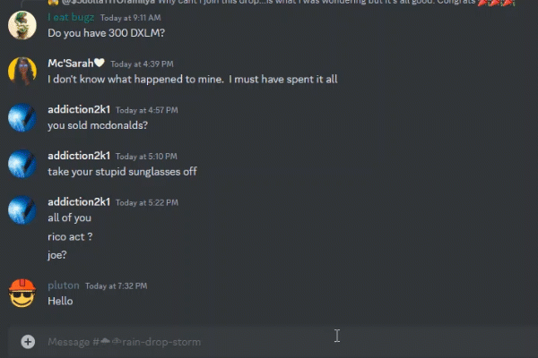{ width="450" }
  <figcaption>Basic tip command</figcaption>
</figure>

* `/tip amount: token: args:last 30mn`: This will tip the last users who actively texted last 30 minutes in the commanded channel.

* `/tipall amount: token:` This will spread the amount of coin to all online users in the Guild (by default). Example: `/tipall 10 doge` will spread your only 10 doge to all online users in the commanded Guild.

<figure markdown>
  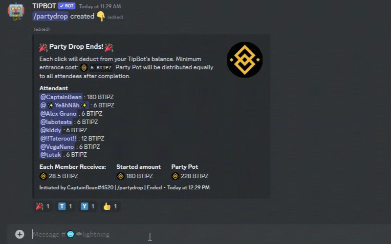{ width="450" }
  <figcaption>Tipall command</figcaption>
</figure>

* `/randtip amount: token:` Do a random tip to a Discord user in the commanded guild.

### Rain / Drop

TipBot contains a few commands for rain such as:

* `/freetip amount: token: duration:` (optional parameters `verify: comment:`): this command allow you to drop an amount of a coin/token for a period set in `duration`. The amount will be split among all the collectors.

<figure markdown>
  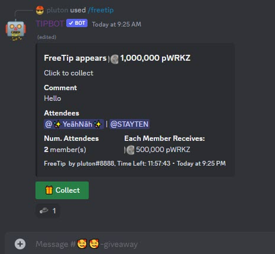{ width="450" }
  <figcaption>/freetip command</figcaption>
</figure>

* `/triviatip amount: token: duration:` TipBot will give a random question and posted 4 answers and only one of them is correct. Reward will be distributed equally to the winner(s).

<figure markdown>
  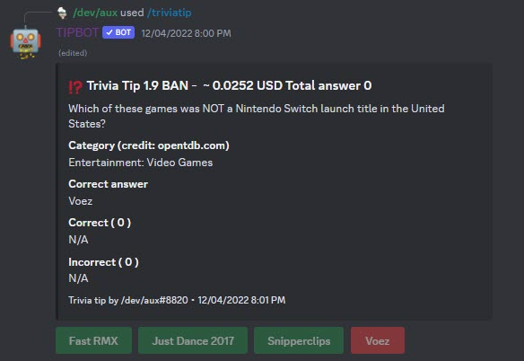{ width="450" }
  <figcaption>/triviatip command</figcaption>
</figure>

* `/mathtip amount: token: duration: math_exp:` Give a `math_exp` and let Discord user select the correct answer among the 4 answers. Reward will be distributed equally to the winner(s).

<figure markdown>
  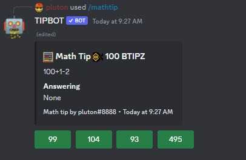{ width="450" }
  <figcaption>/mathtip command</figcaption>
</figure>

* `/quickdrop amount: token:` will drop an amount of a coin/token and the first person collected will get the reward alone.

<figure markdown>
  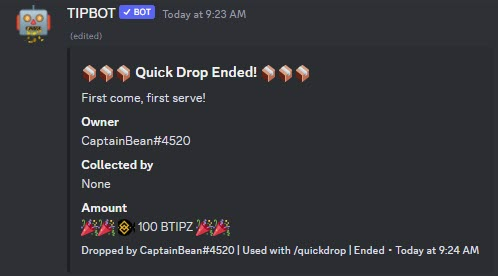{ width="450" }
  <figcaption>/quickdrop command</figcaption>
</figure>

* `/partydrop min_amount: sponsor_amount: token: duration:` let other people to join the `/partydrop` by giving the entry amount with you. The person execute command will need to set the `min_amount` for other participant to join and he/she needs to set what is the amount he/she will initiate at the beginning. Each user can tap to join as many times as they can before the time expires.

<figure markdown>
  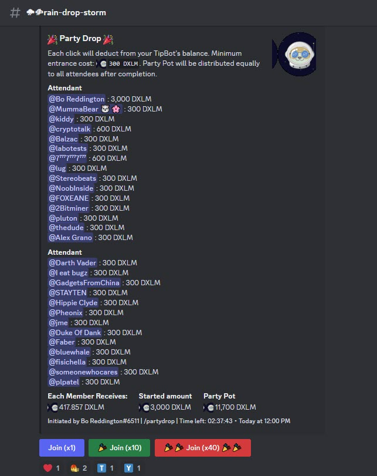{ width="450" }
  <figcaption>/partydrop command</figcaption>
</figure>
