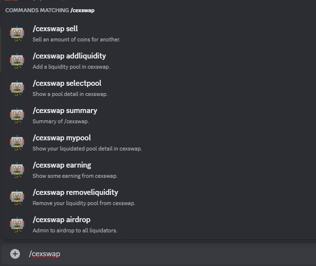
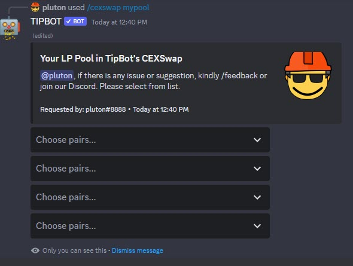
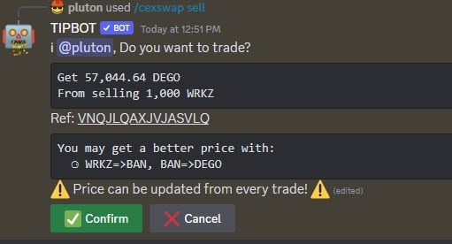
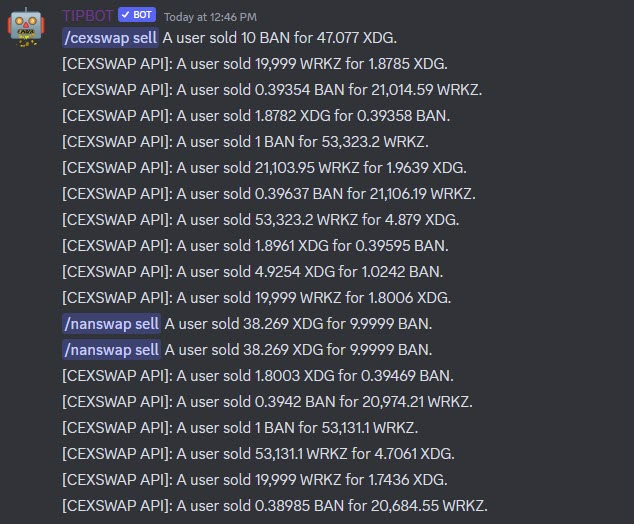
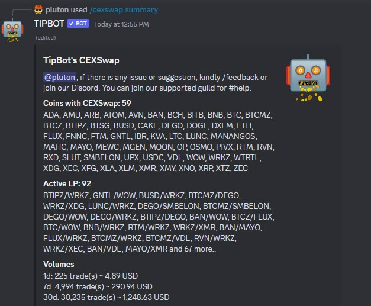

# CEXSwap Commands

TipBot has a trading feature with `/cexswap` command. The trade is using Liqudity Pool provided by other users. The price rate in this CEXSwap is not as per any exchange or price tracking site.

<figure markdown>
  { width="450" }
  <figcaption>CEXSwap's commands</figcaption>
</figure>

## Liquidity Pool

By providing liquidity on TipBot is also a risk. Traders can swap or dump any amount they could have. Always withdraw out from TipBot if all your balances are important!

* `/cexswap addliquidity pool_name:` You can add liquidity or create a new liquidity pool through this command. Bot will popup with an input. For an existing pool, TipBot will adjust the rate based on what is in existing pool. If you are the first one who provide the liquidity pool of a pair, the new rate will be based on yours.

* `/cexswap removeliquidity pool_name: percentage:` You can remove your existing pool in CEXSwap from 10% to 100%.

* `/cexswap mypool` Check your liquidity pools with TipBot.

<figure markdown>
  { width="450" }
  <figcaption>CEXSwap's mypool sub-command</figcaption>
</figure>

## Selling / Buying

Each trade, TipBot will alaways ask for a confirmation and show the price impact. After a successful trade, TipBot will also notify to other Discord Guilds where Guild owner assigned a trade channel for it.

* `/cexswap sell amount: sell_token: for_token:` You can sell a token for another token through `sell` sub-command.

<figure markdown>
  { width="450" }
  <figcaption>CEXSwap's sell sub-command (TipBot asks for confirmation)</figcaption>
</figure>

<figure markdown>
  { width="450" }
  <figcaption>CEXSwap's trade notification</figcaption>
</figure>

## Fee

Every trade, user will get **99%** of the traded coin. The other **1%** will be distributed:

* **0.25%** dev fee.

* **0.25%** to Guild's tipjar if trader run the command in public.

* **0.5%** to all liquidators distributed by their shared pools.

## Other commands

* `/cexswap summary` Get the summary of CEXSwap.

<figure markdown>
  { width="450" }
  <figcaption>CEXSwap's summary</figcaption>
</figure>

* `/cexswap earning` Check your total earning from putting coins/tokens on Liqudity Pool.

## API For CEXSwap

* <https://tipbot-public-api.cexswap.cc/manual>

* <https://github.com/wrkzcoin/TipBot/blob/development/CEXSWAP_API.md>
