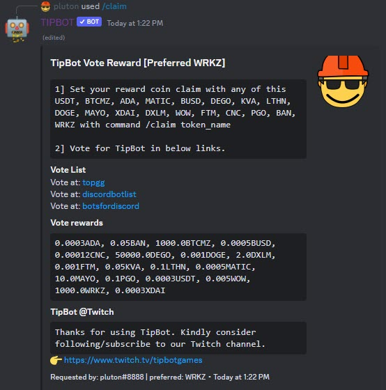

# Faucet & Reward commands

TipBot has a built-in faucet with a random coins.

## Bot's faucet

* `/take` You can get a random faucet from this command every **24h**. Make sure you do it in public and in an assigned channel if it's not your own private Discord Guild.

This Bot's faucet is different from `/faucet` command. Please see [Guild Command](./guild_commands.md).

## Bot vote's reward

* `/claim token:` There are currently three vote reward that supports with TipBot. Before getting rewards, you need to set what coin/token you prefer as a reward for Bot's voting and you set it only once. In case you want to change to another coin/token, you need to execute `/claim token:` again.

<figure markdown>
  { width="450" }
  <figcaption>Claim command (for TipBot's vote reward)</figcaption>
</figure>

* <https://top.gg/bot/474841349968101386/vote>

* <https://discordbotlist.com/bots/tipbot/upvote>

* <https://discords.com/bots/bot/474841349968101386/vote>

