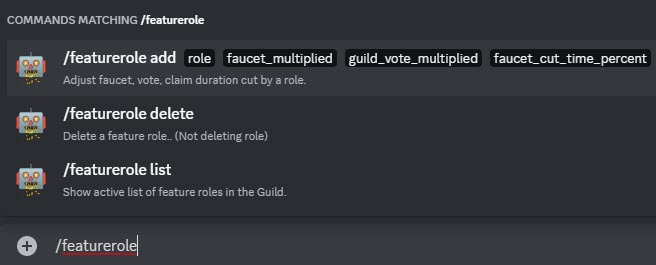

# Feature role commands

As a Guild Owner or Guild's moderator, you can set some special feature to your selling role(s). Check [Guild Shop Command](./gshop_commands.md) for more details.

<figure markdown>
  { width="450" }
  <figcaption>Feature role command (/gshop)</figcaption>
</figure>
