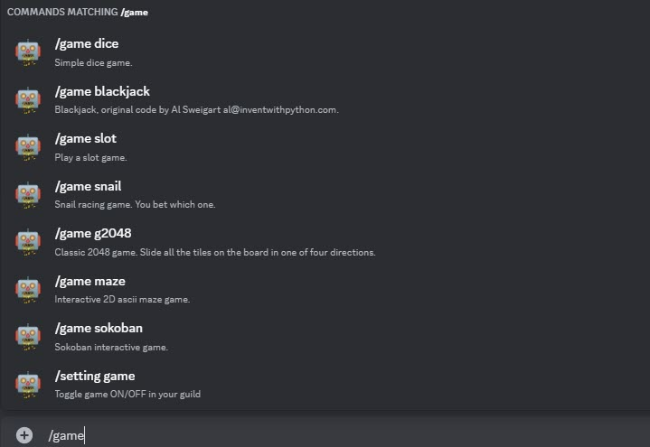
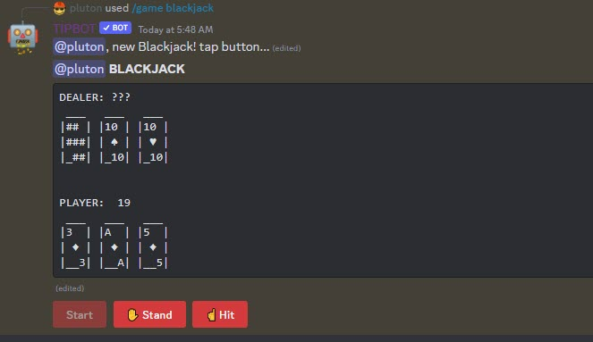
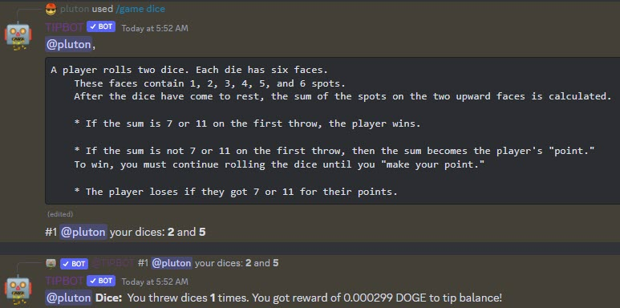
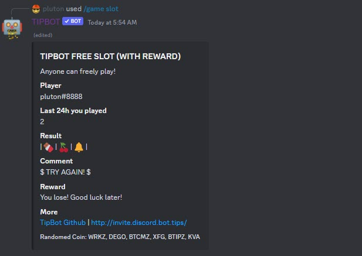
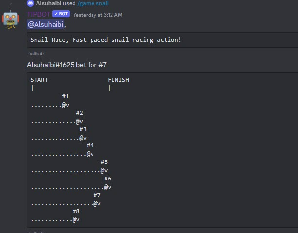
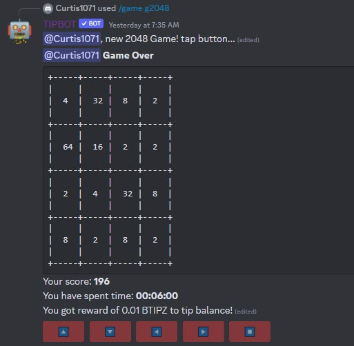
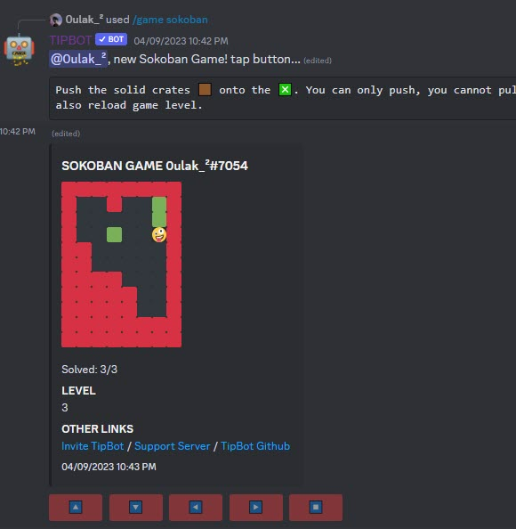
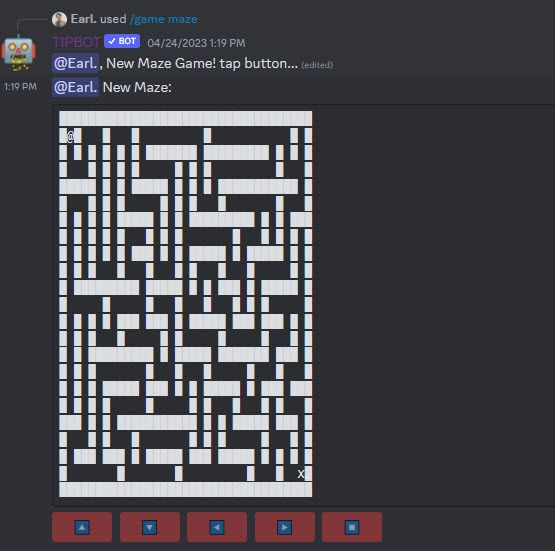

# Game commands

There are a few game commands and they could give you random cryptocurrency rewards. Guild owner or guild moderator could turn game feature ON/OFF in their guild with command `/setting game`, it will toggle between on and off. Guild moderator could also assign a specific game to a dedicated channel via command `/setting gamechan game:`, bot will the channel where you type to that specific game.

{ width="450" }

* `/game blackjack`

{ width="450" }

* `/game dice`

{ width="450" }

* `/game slot`

{ width="450" }

* `/game snail bet_numb:`

{ width="450" }

* `/game g2048`: this is a classic 2048 game where you have to navigate the buttons.

{ width="450" }

* `/game sokoban`: Interactive sokoban game with buttons. This TipBot's game has various level up.

{ width="450" }

* `/game maze`: a classic maze game and you need to use buttons to move find path out.

{ width="450" }
