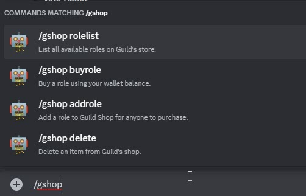

# Guild Shop commands

It's possible you can sell your Discord Guild's role(s) for cryptocurrency that supported by our TipBot. Additionally, your Discord user could get more benefit when you (as a moderator of the Guild) set those selling roles with [Feature Role Command](./featurerole_commands.md) such as bonus for voting, time cooldown for Guild's faucet, bonus multiplier, etc.

<figure markdown>
  { width="450" }
  <figcaption>Guild shop's command (/gshop)</figcaption>
</figure>

* `/gshop addrole role_name: stocks: amount: token: duration:` Add a new selling role item to your Guild Shop.

* `/gshop delete item_id:` Delete the listed selling role item from your Guild Shop.

* `/gshop buyrole item_id:` A Discord user could by your Guild's role by this command.

* `/gshop rolelist` List all available selling role.