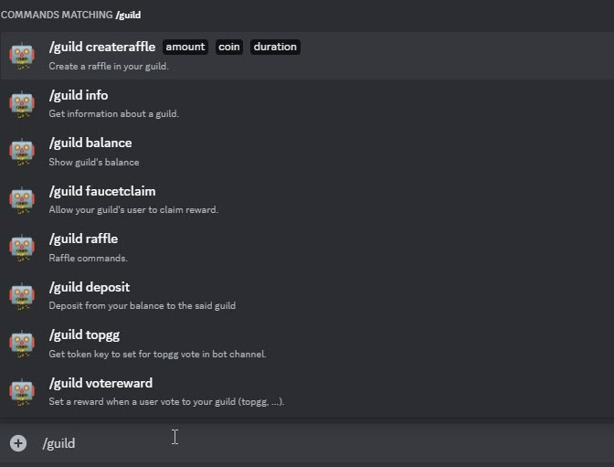
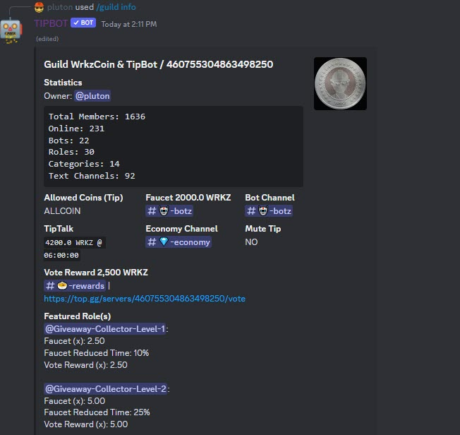
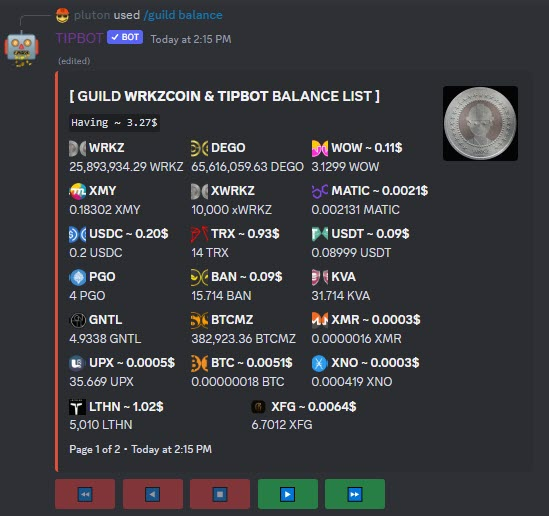
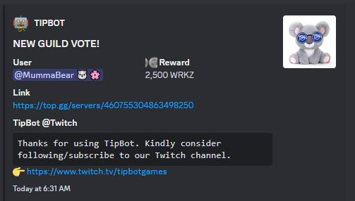

# Guild commands

Guild commands are executed only in public. Another feature of crypto tipping with guild of our TipBot, it's possible you can let your Guild's moderator(s) to use your Guild's tipjar to tip other people with command `/guild tip`.

The balance from a Discord Guild is not belongs to anyone but to the Guild and it can be only spent for tipping, Guild vote reward at <http://top.gg>.

{ width="450" }

* `/guild info` Check the Guild info.

{ width="450" }

* `/guild balance` Check Discord Guild's balance. Anyone can check without any moderator access.

{ width="450" }

* `/guild faucetclaim amount: coin: duration: channel:` Set a `/faucet` amount, coin, duration and assign to a channel and let other Discord users to claim for it. You can set any cryptocurrency that support inside our TipBot. This feature allow your Discord to gain more users and interaction.

* `/guild deposit amount: coin:` Deposit a cryptocurrency from your own balance to the Guild.

* `/guild topgg` Get a key to set vote reward for your Discord Guild at <http://top.gg>.

* `/guild votereward amount: coin: channel:` Set vote reward amount when a Discord user vote for your Guild at <http://top.gg>. TipBot will always push notification to the assigned channel for every vote with rewrad.

{ width="450" }