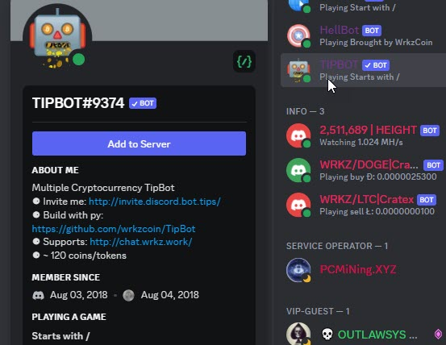
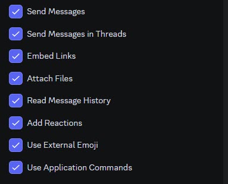

# Home

Our Discord TipBot is working only with / (slash command) as required by Discord.

If you have any issue with these help, kindly join our Discord <http://join.btipz.com>{:target="_blank"}.

To get started, you should start with [basic commands](./basic_discord_commands.md).

### How to invite TipBot

* You can click on TipBot in the name list of any Discod Guild that you are with our TipBot and tap on the button "Add to Server".

<figure markdown>
  { width="450" }
  <figcaption>Add TipBot to Server</figcaption>
</figure>

* Another option to invite our TipBot is by using an [invitation link]<http://invite.discord.bot.tips/>{:target="_blank"}. Discord will ask for your confirmation, select server and the required permission. Make sure you tick on necessary permissions.

<figure markdown>
  { width="450" }
  <figcaption>Minimum Guild's permission</figcaption>
</figure>

### YouTube guides

* TipBot v2 Playlist: <https://www.youtube.com/playlist?list=PLdhRV9sbg4Cqwn8CuaZJ_hAjnnpscOLum>{:target="_blank"}

### Our Discord

* WrkzCoin: <https://discordapp.com/invite/GpHzURM>{:target="_blank"}

* BTIPZ: <http://join.btipz.com>{:target="_blank"}

* Bot invitation link: <http://invite.discord.bot.tips>{:target="_blank"}

### TipBot Source

* GitHub in Python: <https://github.com/wrkzcoin/TipBot>{:target="_blank"}

* This Doc: <https://0xbtipz.github.io/TipBot-Docs/>{:target="_blank"}

### TipBot directory links

* topgg: <https://top.gg/bot/474841349968101386/>{:target="_blank"}

* discordbotlist: <https://discordbotlist.com/bots/tipbot/>{:target="_blank"}

* discords.com: <https://discords.com/bots/bot/474841349968101386>{:target="_blank"}

