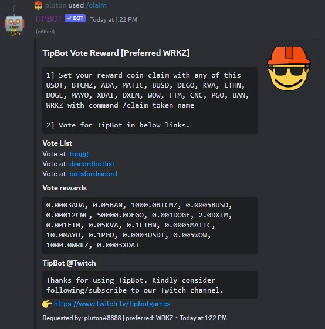

# Market Commands

`/market` is the old trading feature in TipBot where people can trade an exact amount to another people using p2p method. For better trade experience, we suggest you to use with [CEXSwap](./cexswap_commands.md)

<figure markdown>
  { width="450" }
  <figcaption>Market commands</figcaption>
</figure>

