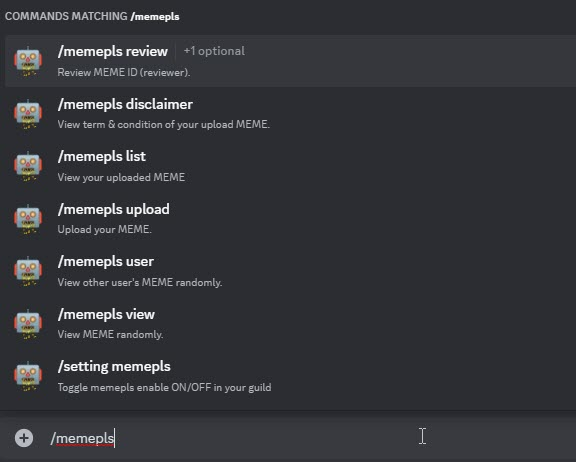
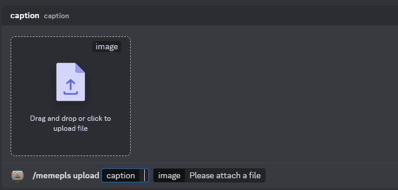

# Memepls Commands

Memepls command allow your Discord User to upload MEME image in your Guild. Other people can also browse all uploaded MEME in your Guild and they could tip from their tip balance to the uploader.

Each uploaded MEME needs to be approved by Guild's moderator or owner.

{ width="450" }

## View

* `/memepls view` Anyone can view uploaded MEME randomly and they could use the interactive buttons to tip the uploader.

<figure markdown>
  { width="450" }
  <figcaption>MEME View & Tip</figcaption>
</figure>

## View

* `/memepls upload` You need to input caption and attach an image file (PNG or JPEG)

<figure markdown>
  { width="450" }
  <figcaption>MEME Upload</figcaption>
</figure>

## Other MEME Commands

* `/memepls review meme_id:` Guild Moderator to review pending uploaded MEME by their Discord Guild.

* `/memepls user user:` View randomly uploaded MEME by a user.

* `/memepls list` View your uploaded MEME.

* `/setting memepls` Toggle MEME commands ON/OFF in your Guild.