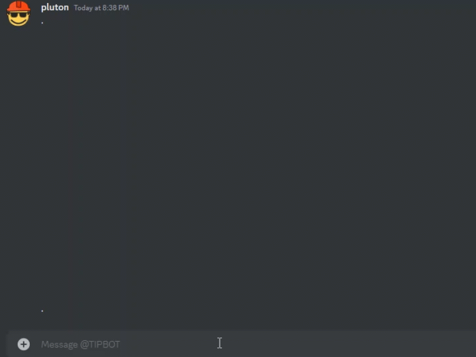
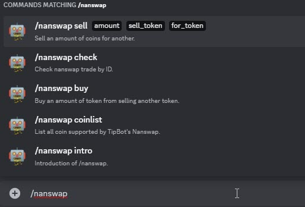

# Nanswap command

If you have any issue with these help, kindly join our Discord <http://join.btipz.com>{:target="_blank"}.

`/nanswap` command (with sub-commands) allow you to trade with dozen of coin/tokens on <https://nanswap.com/>{:target="_blank"} using their API.

<figure markdown>
  { width="450" }
  <figcaption>Nanswap command</figcaption>
</figure>

Other `/nanswap` commands:

<figure markdown>
  { width="450" }
  <figcaption>Other nanswap commands</figcaption>
</figure>

!!! note
    If you have any issue with delaying of exchange using `/nanswap`, 
    take note and share the nanswap ID given by TipBot. 
    You can also check the ID with command `/nanswap check id:`

