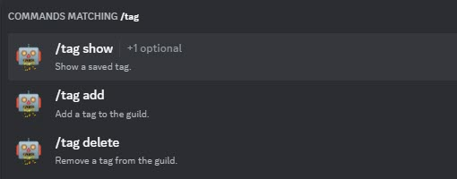
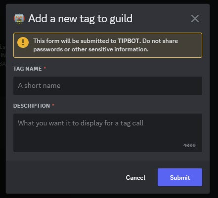
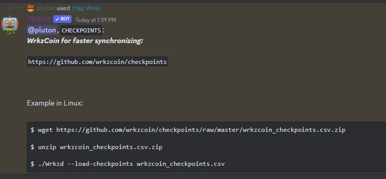
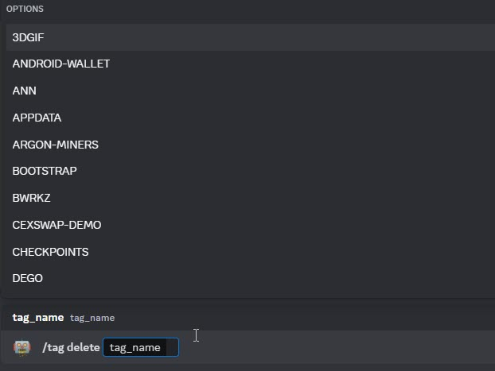

# Tag Commands

TipBot allows you to add some tags so you can easily call them anytime you would like to show to other Discord users in your Guild.

<figure markdown>
  { width="450" }
  <figcaption>Tag command</figcaption>
</figure>

* `/tag add` TipBot will popup and ask your input about tag name and description

<figure markdown>
  { width="450" }
  <figcaption>Tag add sub-command</figcaption>
</figure>

* `/tag show` Let TipBot show you the description correspondent to a **tag**.

<figure markdown>
  { width="450" }
  <figcaption>Tag show sub-command</figcaption>
</figure>

* `/tag delete tag_name:` Delete a **tag** from your Discord Guild.

<figure markdown>
  { width="450" }
  <figcaption>Tag delete sub-command</figcaption>
</figure>