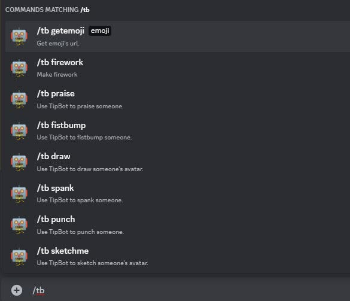
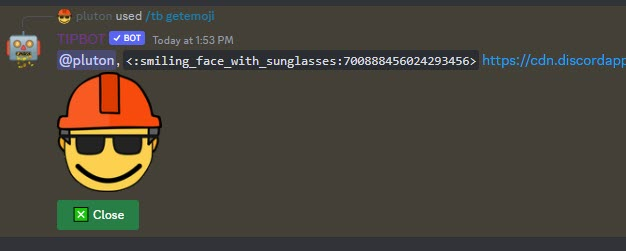
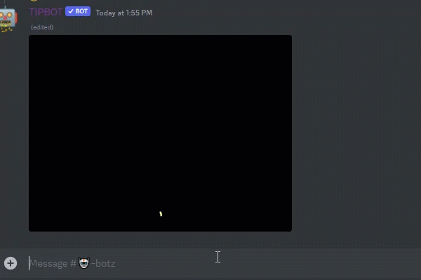
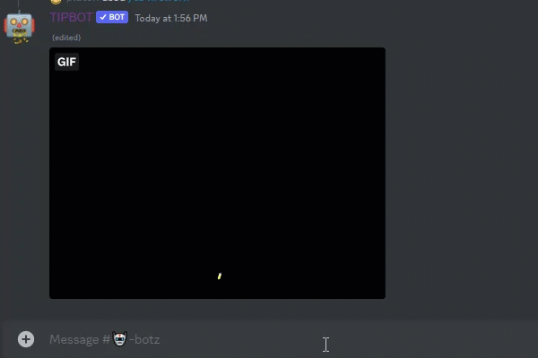

# TB Commands

TipBot has some fun with `/tb`.

{ width="450" }

{ width="450" }

* `/tb getemoji emoji:` You can get emoji code including animated emoji.

{ width="450" }

* `/tb firework member:` Make firework from any user in your Discord guild.

{ width="450" }

* `/tb praise member:` Praise someone in your Discord Guild.

{ width="450" }
