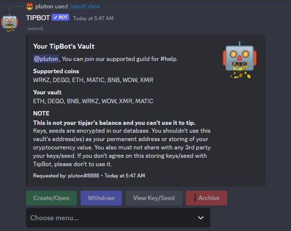
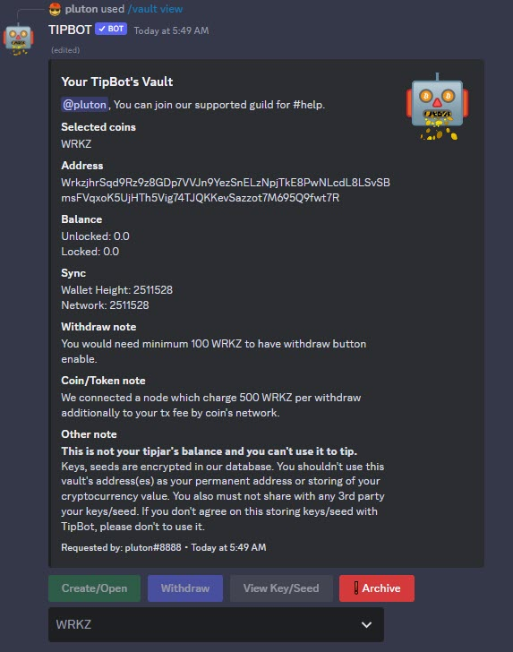
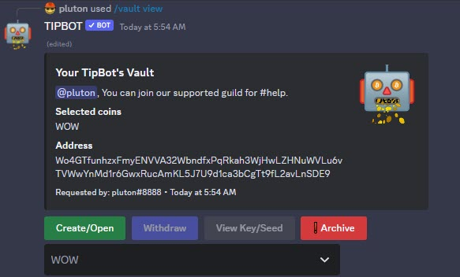

# Vault

Vault is a feature of TipBot. It's separated from your tipjar's address. You and TipBot will have shared keys/seed and you can import the keys to your own external wallet app.

Keys, seeds are encrypted in our database. You shouldn't use this vault's address(es) as your permanent address or storing of your cryptocurrency value. You also must not share with any 3rd party your keys/seed. If you don't agree on this storing keys/seed with TipBot, please don't to use this command.

Currently, TipBot's vault supports **WRKZ, DEGO, ETH, MATIC, BNB, WOW, XMR**. You can create, backup keys, withdraw, archive them anytime

{ width="450" }

## Select Coin/Token
Use dropdown menu to select coin/token and follow the menu's instruction if you haven't created a wallet for a coin/token yet. For Wownero and Monero coins, you always need to open a wallet first.

{ width="450" }

{ width="450" }

!!! note
    **You can backup only once for each coin/token.**
