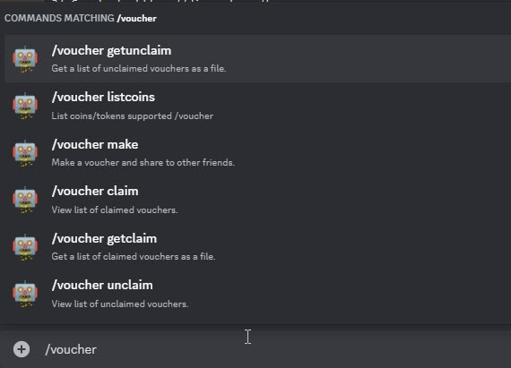
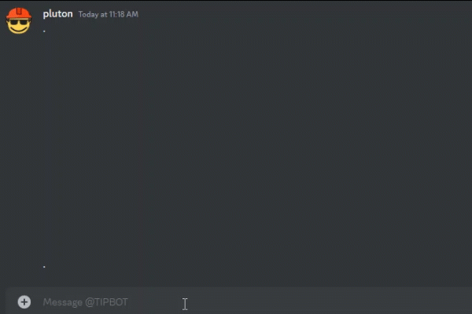
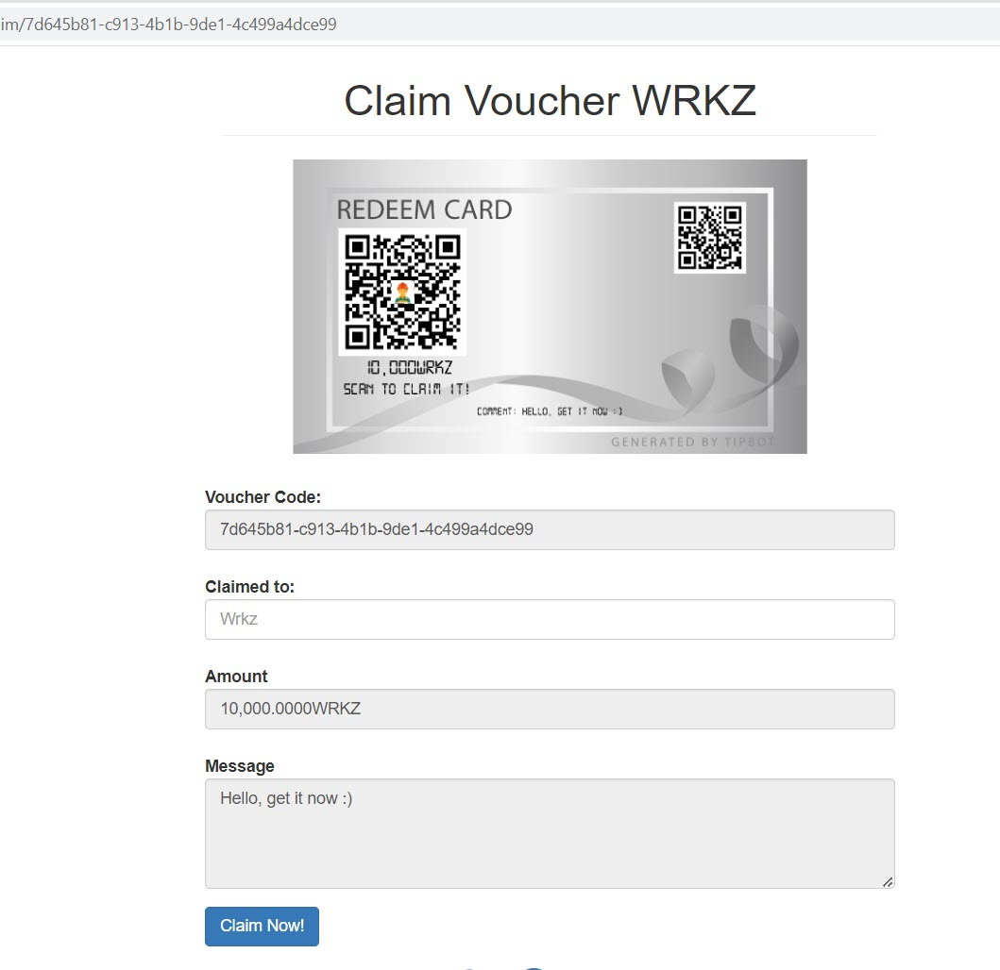

# Voucher Commands

TipBot could allow you to create voucher(s) and let other users (even not in Discord) to claim cryptocurrency from your tip balance. Currently, we support few coins including **WRKZ, WOW, GNTL**. We could expand the support to other coins/tokens in the future if there are more demands and requests.

{ width="450" }

## Make & Claim

Each time you create one or more vouchers, TipBot will deduct from your tip balance.

<figure markdown>
  { width="450" }
  <figcaption>Make voucher</figcaption>
</figure>

<figure markdown>
  { width="450" }
  <figcaption>Link to claim voucher</figcaption>
</figure>
